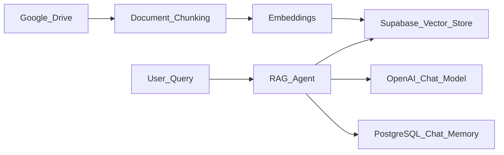
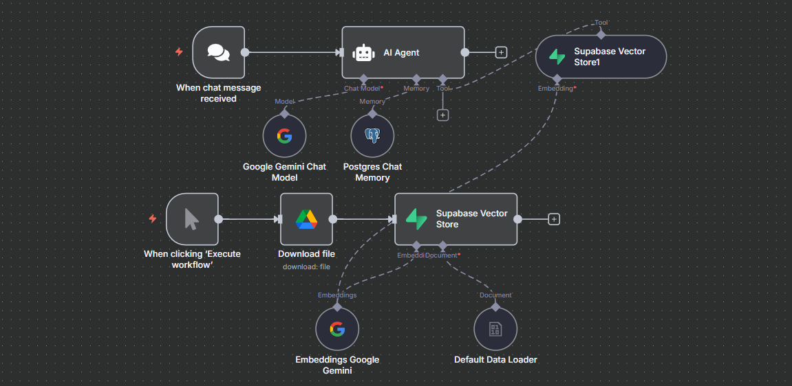
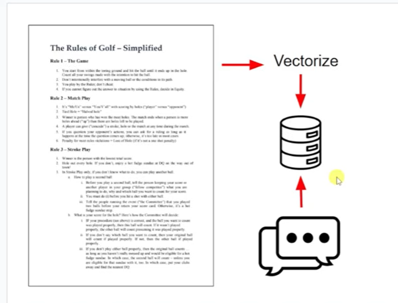
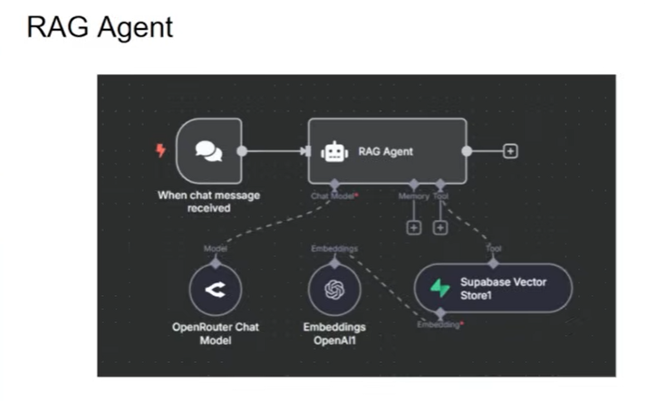
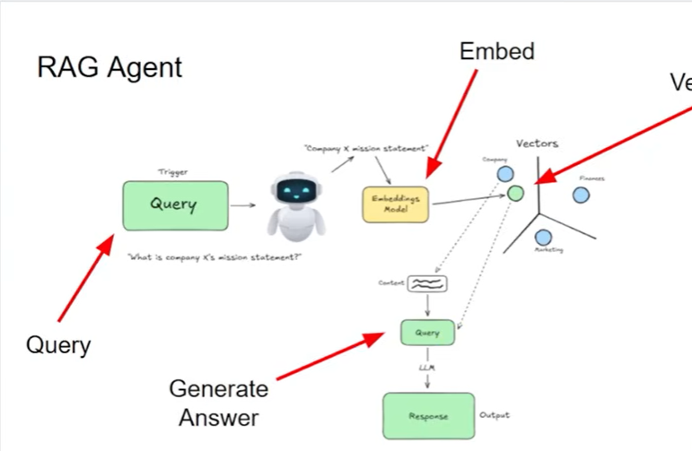

# RAG AI Agent with n8n and Supabase

Build a powerful Retrieval-Augmented Generation (RAG) AI agent that intelligently answers questions by retrieving and processing your own data sources. This project leverages no-code workflow builder n8n and Supabase vector database for easy and scalable implementation.

***

## Project Overview

This project automates the process of vectorizing documents, embedding them into a Supabase vector database, and setting up an AI agent that can chat and respond with context-aware answers by querying the vector store.

- **Automated document ingestion:** Break down PDFs and other documents into text chunks via n8n workflows.
- **Embedding and vector storage:** Use OpenAI or Google Gemini embeddings stored in Supabase for ultra-fast retrieval.
- **AI agent Q&A:** Natural language conversation powered by GPT models, augmented with vector database search results.
- **Persistent chat memory:** Keep user session history for dynamic and meaningful conversations.

***

## Workflow Architecture

1. Documents (e.g., PDFs) are loaded from Google Drive and chunked into smaller parts.
2. Each chunk is embedded into a high-dimensional vector using an LLM API (OpenAI or Gemini).
3. Chunks are indexed and stored in Supabase’s vector database.
4. A user query triggers the RAG Agent, which uses vector search to find relevant chunks.
5. The query plus retrieved chunks are sent to the LLM to generate an informed response.
6. Conversation context is maintained via PostgreSQL chat memory for multi-turn dialogues.

## Features

- Fully no-code RAG agent workflow in n8n
- Integration with Google Drive, Supabase, and OpenAI/Gemini
- Persistent memory for conversational context
- Supports PDF and document ingestion at scale
- Real-time client-agent chat with vector enhanced understanding

## Usage

- Clone this repo and import the n8n workflow JSON.
- Configure your Supabase project, OpenAI/Gemini API keys, Google Drive access, and PostgreSQL memory.
- Use the UI to run and test your RAG AI agent interactions.
- Extend with additional data sources and agent triggers as needed.

## Visual Workflow Overview

Below are key screenshots showing major stages of the RAG AI Agent lifecycle as automated in n8n:

- **PDF Ingestion**  
  
  documents are loaded from Google Drive or user uploads as part of the
  automation flow.
 
- **RAG Agent Process**  
  
    
  The central view of the RAG agent orchestration—showing tools, nodes, and   integration points within n8n.  

  
  Example of an agent node connecting to embedding models and vector search.

- **Vectorization Pipeline**  
  
    
  A schematic (or n8n node screenshot) illustrating the flow: document  chunking → embedding → vector DB upload.

- **Automation Workflow**  
  
    
  High-level automation showing document retrieval, agent triggers, and query/response path.

***

### How the RAG AI Workflow Works

This automation leverages n8n to connect document data sources, process content into searchable vectors, and trigger a retrieval-augmented AI agent to answer questions using your private knowledge base. The diagram and screenshots below give an at-a-glance guide to the core components and data paths.

***

## Technologies Used

- n8n (workflow automation)
- Supabase (vector database & Postgres chat memory)
- Google Drive (document source)
- OpenAI / Google Gemini (embeddings and chat)
- PostgreSQL (chat history memory)

***
